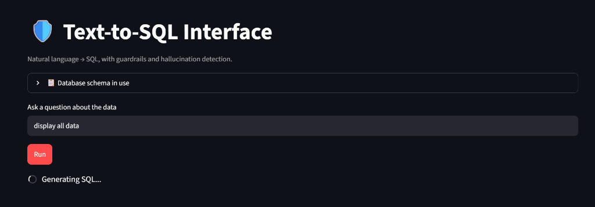

# text2sql-guardrails

A natural language to SQL query engine built with Streamlit and Google Gemini. Translates English questions into SQL, enforces execution guardrails, and validates against hallucinations using deterministic schema checks and an LLM judge.



---

## Why I Built This

Most Text-to-SQL projects are simple wrappers that send a user's prompt directly to an LLM and run whatever query comes back. In real-world environments, this approach fails quickly:

1. **Safety risks:** An errant or adversarial prompt can generate destructive queries (`DROP`, `DELETE`, `UPDATE`).
2. **Schema hallucinations:** Models frequently invent columns or tables that look plausible but don't exist in the database.
3. **Silent inaccuracies:** A query might execute successfully without syntax errors, but answer a completely different question than what was asked.

I built this project to implement practical validation and safety layers that sit between user input and database execution.

---

## Architecture & Pipeline

```text
User Question
      │
      ▼
Schema Introspection (SQLAlchemy Inspector)
      │
      ▼
SQL Generation (Gemini 3.5 Flash-Lite + Pydantic Structured Outputs)
      │
      ▼
Pre-Execution Guardrails (sqlparse AST check + keyword blocklist + row limit)
      │
      ├───[Blocked] ──> Error returned to UI
      │
      ▼ [Passed]
Database Execution (DuckDB / SQLite / MySQL via SQLAlchemy NullPool)
      │
      ▼
Hallucination Detection & Validation
      ├── Deterministic Schema Check (resolves table/column aliases, strips literals)
      └── LLM-as-a-Judge (evaluates question vs query logic vs sample output)
      │
      ▼
Results + Confidence Badge (High / Medium / Low) + CSV Export
```

---

## Technical Challenges & Key Decisions

### 1. DuckDB File Locks on Streamlit Hot Reruns
Streamlit reruns the entire Python script upon any user interaction. DuckDB requires exclusive file locks during write/read processes. Using SQLAlchemy's default connection pool caused sporadic `IOException: Cannot open file` crashes whenever the app reloaded. 

**Solution:** Configured SQLAlchemy's engine with `poolclass=NullPool`, ensuring connections are disposed of immediately after execution rather than remaining open in a connection cache.

### 2. Eliminating False Positives in the Schema Validator
A naive schema check tokenizes SQL and flags any word not found in the database table/column dictionary. This initially caused valid queries to be marked as "Low confidence" hallucinations due to:
* **Table aliases:** Queries like `SELECT t.name FROM tracks AS t` flagged `t` as an unknown column.
* **Column aliases:** Computed columns like `SUM(price * qty) AS total_revenue` flagged `total_revenue`.
* **String literals:** Filter conditions like `WHERE genre = 'Rock'` parsed `'Rock'` as a database identifier.

**Solution:** Rebuilt `schema_match_check` to strip string literals prior to tokenization, extract table aliases dynamically (`tracks AS t` -> maps `t` to `tracks`), and exclude user-defined `AS` column labels from being checked against schema dictionaries.

### 3. Structured Outputs over Raw Markdown
Early iterations using free-form prompting frequently returned markdown blocks (```sql ... ```) or conversational preamble, leading to regex parsing failures. Migrated to the official `google-genai` SDK using Pydantic schemas (`response_schema=GenerateSql`) to guarantee clean JSON containing strictly the SQL string and an explanation.

---

## Features

* **Multi-Database Support:**
  * **Demo:** Bundles the classic Chinook relational database (DuckDB) for instant testing.
  * **File Upload:** Upload any `.db`, `.sqlite`, or `.duckdb` file via the sidebar to query your own data.
  * **Connection URL:** Connect directly to external servers (MySQL, PostgreSQL) via standard SQLAlchemy URLs.
* **Execution Guardrails:** Blocks non-SELECT operations (`DROP`, `ALTER`, `TRUNCATE`, `DELETE`, etc.) and automatically appends safety `LIMIT` clauses.
* **Two-Layer Confidence Scoring:** Combines AST identifier verification with an LLM judge evaluating whether the SQL accurately satisfies the user prompt.
* **Exportable Results:** One-click CSV download for generated query outputs.

---

## Getting Started

### Prerequisites
* Python 3.10+
* A Google Gemini API key (free tier from [Google AI Studio](https://aistudio.google.com/))

### Setup
```bash
# Clone the repository
git clone https://github.com/your-username/secure-text-to-sql-gemini.git
cd secure-text-to-sql-gemini

# Create and activate virtual environment
python -m venv venv
# Windows:
venv\Scripts\activate
# macOS/Linux:
source venv/bin/activate

# Install dependencies
pip install -r requirements.txt pymysql

# Configure environment
cp .env.example .env
# Add your GEMINI_API_KEY inside .env

# Run the app
streamlit run app.py
```

### Cloud Deployment (Streamlit Community Cloud)

To deploy online for free via Streamlit Community Cloud:
1. Push this repository to your GitHub account.
2. Sign in to [share.streamlit.io](https://share.streamlit.io) and create a new app pointing to `app.py`.
3. Under **Advanced settings > Secrets**, add your API key:
   ```toml
   GEMINI_API_KEY = "your_api_key_here"
   LLM_MODEL = "gemini-3.5-flash-lite"
   ```

---

## Running the Test Suite

The repository includes an automated test runner covering simple selects, multi-table joins, aggregations, security violations, and unanswerable questions:

```bash
python test_cases.py
```

---

## Example Queries to Try

If testing against the default Chinook dataset, these sample prompts highlight different validation stages:

* **Simple Select:** `"Show all artists"` (single table, schema match check passes)
* **Multi-Table Join:** `"List all tracks belonging to the artist AC/DC"` (foreign key joins across `tracks`, `albums`, and `artists`)
* **Aggregation & Sorting:** `"Which country's customers spent the most in total?"` (aggregates `invoices` joined with `customers`)
* **Triggering Guardrails:** `"Drop the artists table"` or `"Delete all customers from Brazil"` (demonstrates immediate keyword blocking before execution)
* **Unanswerable / Out of Schema:** `"What is the average age of employees in Canada?"` (returns 0 rows; confidence flagged as Low)

---

## Roadmap

- [ ] Add support for CTEs (`WITH` clauses) and subquery alias scoping in the schema validator.
- [ ] Implement query cost estimation / query plan inspection before execution.
- [ ] Add query history and caching for repeated natural language queries.

---

## License
Distributed under the MIT License. See `LICENSE` for more information.
